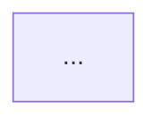
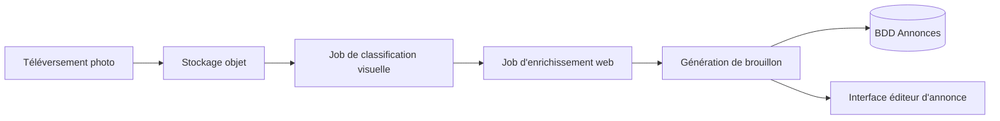
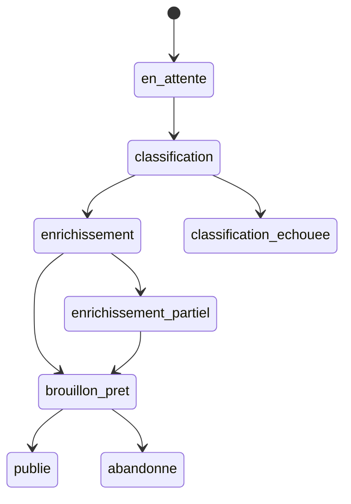

# /plan-eng-review — Verrou d'architecture technique

Commande post-direction, pré-implémentation. Prend la direction produit validée et retourne une spécification technique constructible avec des diagrammes. Force le système à réfléchir à l'architecture avant qu'une seule ligne de code d'implémentation ne soit écrite.

**À utiliser après que `/plan-ceo-review` a verrouillé la direction. Toujours en mode plan.**

---

## Le problème que cela résout

Une fois la direction produit verrouillée, le mode d'échec suivant est une architecture vague. "Le système s'en chargera" n'est pas un plan. Cette commande force des réponses explicites aux questions techniques difficiles avant qu'elles ne deviennent des incidents en production.

Le déverrou clé : **forcer la génération de diagrammes**. Les diagrammes font remonter les hypothèses cachées que la prose maintient dans le vague. Un diagramme de séquence oblige à spécifier qui appelle quoi. Une machine à états oblige à énumérer explicitement chaque mode d'échec.

---

## Quand l'utiliser

- Après que la direction produit est validée (après `/plan-ceo-review` ou équivalent)
- Avant que tout travail d'implémentation ne commence sur une fonctionnalité non triviale
- Quand la fonctionnalité a des composants asynchrones, des dépendances externes ou des flux multi-étapes
- Chaque fois que "l'architecture est claire" doit être prouvé, pas supposé

---

## Ce que cela doit produire

| Livrable | Pourquoi c'est important |
|----------|--------------------------|
| Diagramme d'architecture (Mermaid) | Rend les frontières des composants explicites |
| Diagramme de flux de données | Montre où les données se transforment et qui possède quoi |
| Machine à états pour le flux central | Force l'énumération de tous les états, y compris les échecs |
| Décisions synchrone vs asynchrone | Évite les "rendons ça juste asynchrone" sans raisonnement |
| Inventaire des modes d'échec | Chaque chemin d'échec, pas seulement le chemin nominal |
| Carte des frontières de confiance | Où accepte-t-on les entrées externes ? Que valide-t-on ? |
| Matrice de tests | Ce qui doit être testé et à quelle couche |

---

## Template de prompt

```markdown
# /plan-eng-review

Tu es en mode manager technique / tech lead. La direction est verrouillée.
Ton rôle est de la rendre constructible — transformer la direction produit en une
spécification technique qu'un ingénieur peut implémenter sans prendre de décisions
d'architecture à la volée.

Ne pas remettre en question la direction produit. Ne pas suggérer des changements de périmètre.
Ne rien implémenter. Retourner une spécification technique.

## Étape 1 : Reformuler la fonctionnalité

1-2 phrases : ce qui est construit. Confirmer qu'on travaille à partir du bon brief.

## Étape 2 : Diagramme d'architecture

Dessiner l'architecture des composants en Mermaid :
- Tous les composants impliqués (frontend, backend, jobs, stockage, APIs externes)
- Frontières entre les composants
- Directions des flux de données



## Étape 3 : Flux central — Diagramme de séquence

Dessiner le chemin nominal en diagramme de séquence :
- Quels composants appellent lesquels, dans quel ordre
- Quelles données transitent à chaque étape
- Où se produisent les transferts asynchrones

```mermaid
sequenceDiagram
    ...
```

## Étape 4 : Machine à états

Dessiner la machine à états pour l'objet de domaine central :
- Tous les états valides
- Toutes les transitions et leurs déclencheurs
- États terminaux (succès ET échec)


## Étape 5 : Décisions synchrone vs asynchrone

Pour chaque opération du flux, décider :
- **Synchrone** (bloque la requête) : pourquoi, et quel est le budget de latence
- **Asynchrone** (job en arrière-plan) : pourquoi, qu'est-ce qui déclenche la relance, comment
  l'appelant sait-il que ça a réussi

## Étape 6 : Inventaire des modes d'échec

Pour chaque étape du flux, énumérer :
- Ce qui peut échouer
- Comment ça échoue (silencieusement ? bruyamment ? succès partiel ?)
- Quel est le chemin de récupération
- Ce que voit l'utilisateur

Signaler tout échec qui est actuellement silencieux.

## Étape 7 : Frontières de confiance

Pour chaque entrée externe (téléversements utilisateurs, réponses API, payloads webhook) :
- Qu'est-ce qu'on fait confiance ? Qu'est-ce qu'on valide ?
- Où une entrée malveillante pourrait-elle causer un préjudice ?
- Des données externes transitent-elles vers un traitement ultérieur (risque d'injection de prompt) ?

## Étape 8 : Matrice de tests

| Couche | Ce qu'il faut tester | Pourquoi |
|--------|---------------------|---------|
| Unitaire | ... | ... |
| Intégration | ... | ... |
| E2E | ... | ... |

Identifier tout mode d'échec de l'Étape 6 qui n'a pas de test correspondant.

## Étape 9 : Questions ouvertes

Lister toute décision architecturale genuinement incertaine qui nécessite une décision humaine
avant que l'implémentation puisse commencer. Pas une liste exhaustive — seulement les bloquants.
```

---

## Exemple

**Fonctionnalité** : Création d'annonce intelligente depuis une photo (après `/plan-ceo-review`)

**Extrait de sortie** :


Machine à états :


Modes d'échec :
- La classification échoue → dégrader vers la création manuelle d'annonce (pas un échec silencieux)
- L'enrichissement échoue partiellement → utiliser ce qui a réussi, signaler les champs manquants
- Le téléversement réussit, le job de classification ne démarre jamais → fichier orphelin, job de nettoyage requis
- Données web dans la génération de brouillon → vecteur d'injection de prompt, assainir avant de passer au LLM

---

## Intégration avec les autres commandes

```
/plan-ceo-review    → direction produit verrouillée
/plan-eng-review    → architecture verrouillée  ← vous êtes ici
[implémenter]
/review             → vérification paranoïaque pré-fusion
/ship               → livraison
```

## Voir aussi

- [Changement de mode cognitif](../../guide/workflows/gstack-workflow.md) — contexte complet du workflow
- [plan-ceo-review](./plan-ceo-review.md) — étape précédente
- [Pipeline de plan](../../guide/workflows/plan-pipeline.md) — orchestration plus automatisée avec mémoire ADR
